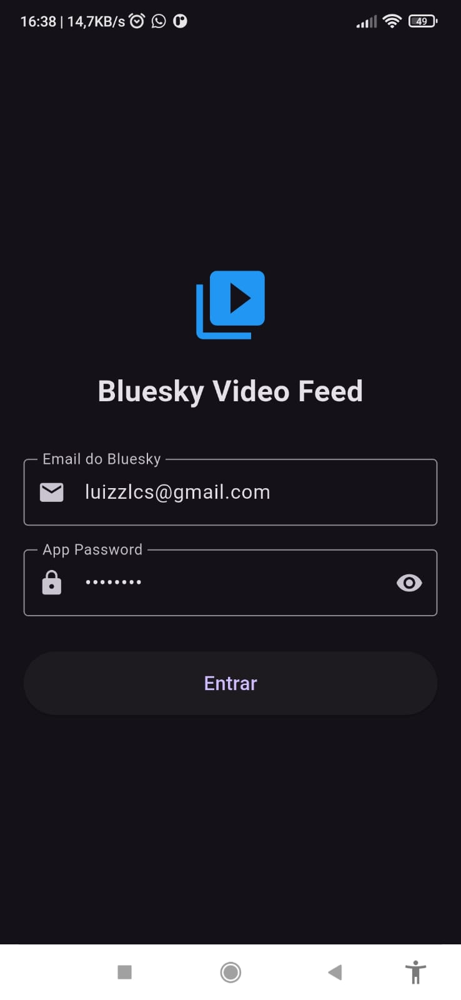

# Bluesky Video Feed

<a href="()"></a>
[ACESSAR  CÓDIGO](https://github.com/luizzlcs/bluesky_video_feed)

<p align="center">
 
</p>

## 🌐 Acesso ao Projeto
O projeto está disponível em:

## 📋 Descrição

O Bluesky Video Feed é uma aplicação Flutter que permite aos usuários visualizar e interagir com vídeos através da plataforma Bluesky. O aplicativo oferece uma interface moderna e intuitiva para navegação e reprodução de conteúdo em vídeo. O projeto já vem configurado com as credenciais de acesso na tela inicial, facilitando o uso imediato.

## ✨ Funcionalidades

- 🔐 Autenticação com Bluesky
- 📺 Reprodução de vídeos
- 🖼️ Visualização de imagens em cache
- 🔄 Feed dinâmico de conteúdo
- 🎯 Interface responsiva e moderna

## 🛠️ Tecnologias Utilizadas

- **Flutter** (^3.7.2) - Framework de desenvolvimento multiplataforma
- **Dart** - Linguagem de programação
- **atproto** (^0.13.3) - Biblioteca para integração com o protocolo AT Protocol
- **atproto_core** (^0.11.2) - Core da biblioteca AT Protocol
- **video_player** (^2.7.0) - Player de vídeo nativo
- **chewie** (^1.7.4) - Player de vídeo personalizado
- **atproto_oauth** (^0.1.0) - Autenticação OAuth para Bluesky
- **http** (^1.2.1) - Cliente HTTP
- **get_it** (^7.6.4) - Injeção de dependências
- **cached_network_image** (^3.3.0) - Cache de imagens da rede

## 🏗️ Arquitetura

O projeto segue uma arquitetura limpa e modular, utilizando:

- **Injeção de Dependência**: Para gerenciamento de dependências
- **Repositórios**: Para abstração da lógica de acesso a dados
- **Serviços**: Para lógica de negócios
- **Widgets**: Para interface do usuário

## 📦 Instalação

### Pré-requisitos

- Flutter SDK (versão ^3.7.2)
- Dart SDK
- Git

### Passos para Instalação

1. Clone o repositório:
```bash
git clone https://github.com/luizzlcs/bluesky_video_feed.git
cd bluesky_video_feed
```

2. Instale as dependências:
```bash
flutter pub get
```

3. Execute o aplicativo:
```bash
flutter run
```

## 🔧 Configuração

O aplicativo já vem pré-configurado com as credenciais de acesso na tela inicial. Não é necessário realizar configurações adicionais para começar a usar.


## 👨‍💻 Autor

Sou desenvolvedor fullstack, sempre buscando entregar soluções completas e eficientes, utilizando tecnologias modernas como Dart e Flutter no front-end e Java no back-end. Desde 2022, trabalho na Ponto Care, criando aplicativos para Android e Web, com foco em inovação, qualidade e garantindo a melhor experiência para o usuário.


[](https://www.linkedin.com/in/luizzlcs/)
